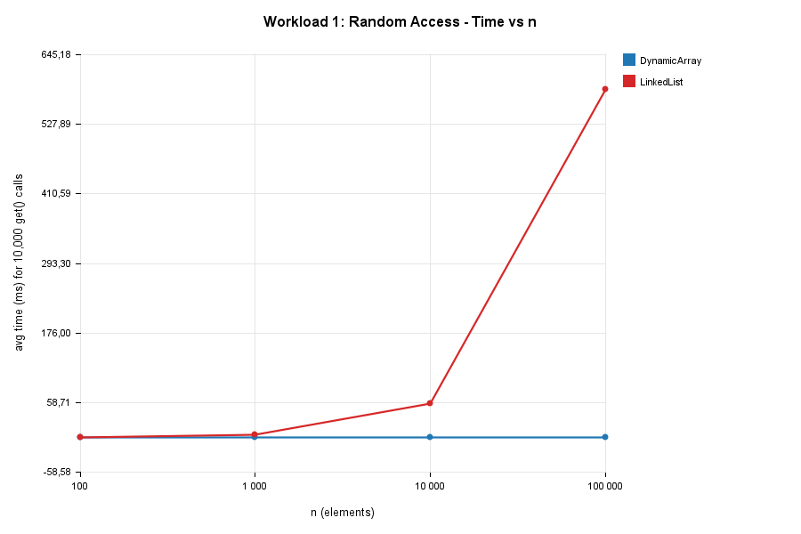

1. Overview

This project implements and analyzes three fundamental data structures in Java:

- DynamicArray — an array-backed list that doubles its capacity when full.
- LinkedList — a singly linked list with head and tail pointers.
- MinHeap — a binary min-heap backed by a growable array.

The goal is not simply to implement these structures correctly (although correctness is
required and tested — see Section 3 and Section 10), but to:

1. prove correctness of two non-trivial operations using loop invariants,
2. derive best/average/worst-case time and auxiliary space complexity for every required
   operation, and
3. empirically measure their performance under four controlled workloads and compare the
   measurements against the theoretical predictions.

 2. Complexity Analysis

Notation: n = number of elements currently stored.

 2.1 Dynamic Array

| Operation        | Best     | Average  | Worst    | Aux. Space |

| add(x)          | Θ(1)     | Θ(1) amortized | O(n) (on resize) | O(1) amortized, O(n) worst (copy) |
| add(index, x)   | Ω(1) (index = n, end) | Θ(n) | O(n) (index = 0) | O(1) |
| remove(index)   | Ω(1) (index = n-1, last) | Θ(n) | O(n) (index = 0) | O(1) |
| get(index)      | Θ(1)     | Θ(1)     | Θ(1)     | O(1) |
| contains(x)     | Ω(1) (found at index 0) | Θ(n) | O(n) (not present / found at the end) | O(1) |

Justification.
get(index) computes a direct memory offset (base + index * elementSize), so it is
Θ(1) in every case — there is no "worst case" that differs from the best case, unlike
the other operations. add(x) (append) is Θ(1) amortized: most calls just write into
a free slot, but every time the backing array is full it must copy all n elements into
a new array of double the size. Because doubling happens only O(log n) times over n
appends, the total copying work is O(n) over n appends, i.e. O(1) amortized per append
(a standard amortized-analysis / accounting-method argument). add(index, x) and
remove(index) must shift every element after index by one slot, so their cost is
proportional to n - index: inserting/removing at the front is worst case (Θ(n) shifts),
at the end is best case (Θ(1) shifts, ignoring the possible resize). contains(x) performs
a linear scan and must be Θ(n) on average/worst case because, without additional structure
(e.g. sorting or hashing), every element may need to be inspected.

 2.2 Linked List (singly linked, head + tail pointers)

| Operation        | Best     | Average  | Worst    | Aux. Space |

| add(x)          | Θ(1)     | Θ(1)     | Θ(1)     | O(1) (tail pointer avoids traversal) |
| add(index, x)   | Ω(1) (index = 0) | Θ(n) | O(n) (index = n-1) | O(1) |
| remove(index)   | Ω(1) (index = 0) | Θ(n) | O(n) (index = n-1) | O(1) |
| get(index)      | Ω(1) (index = 0) | Θ(n) | O(n) (index = n-1) | O(1) |
| contains(x)     | Ω(1) (found at head) | Θ(n) | O(n) | O(1) |

**Justification.**
Because the list keeps an explicit tail pointer, appending (add(x)) is Θ(1) in every
case — no traversal is needed. Every *index-based* operation (get, add(index,x),
remove(index)), however, requires walking the list from head one node at a time,
because a singly linked list offers no random access: cost is Θ(index), so best case is
index = 0 and worst case is index = n − 1 (or n for insertion). This is the key practical
difference from the Dynamic Array's get, which is Θ(1) regardless of index — see
Section 2.4.

### 2.3 Min-Heap (binary, array-backed)

| Operation        | Best        | Average     | Worst       | Aux. Space |
|-------------------|-------------|-------------|-------------|------------|
| insert(x)       | Ω(1) (new min stays at bottom) | Θ(log n) | O(log n) | O(1) |
| peekMin()       | Θ(1)        | Θ(1)        | Θ(1)        | O(1) |
| extractMin()    | Ω(1) (heap becomes empty / trivial sift) | Θ(log n) | O(log n) | O(1) |

**Justification.**
The heap is a complete binary tree of height ⌈log₂(n+1)⌉ stored implicitly in an array.
insert(x) places the new element at the next free leaf and "sifts up" while it is
smaller than its parent; in the worst case it travels from a leaf to the root, i.e.
O(log n) swaps/comparisons. Best case is O(1): the new element already satisfies the heap
property with its parent and the loop exits immediately (e.g. inserting into an empty
heap, or inserting a large value). extractMin() moves the last element to the root and
"sifts down" along one root-to-leaf path, again O(log n) in the worst case and O(1) in the
best case (e.g. the moved element is already ≤ both children). peekMin() simply reads
data[0], Θ(1) always. Amortized array growth for insert adds O(1) amortized extra,
same argument as DynamicArray.add(x).

### 2.4 Operations that look similar but differ in practical cost

- **`get(index)`: Dynamic Array Θ(1) vs. Linked List Θ(n).** Both "get an element at a
  position" conceptually, but random access (array) vs. sequential access (list) makes
  this the single biggest practical difference between the two structures — see
  Workload 1.
- **`add(0, x)` (insert at front): Dynamic Array Θ(n) vs. Linked List Θ(1).** The array
  must shift everything right; the list just relinks the head pointer. This is the
  inverse relationship to `get`.
- **`insert(x)` on a heap vs. `add(x)` (append) on an array/list:** both are "add an
  element," but the heap must additionally restore a structural invariant (the heap
  property), costing O(log n) instead of O(1)/O(1)-amortized.
- **`peekMin()` vs. `extractMin()`:** both "look at the minimum," but only `extractMin`
  needs to repair the heap afterward, so peek is Θ(1) while extract is O(log n).

## 3. Correctness — Loop Invariant Proofs

Two non-trivial operations are proved correct below. The first (`MinHeap.insert`)
involves a loop, satisfying the assignment's requirement that at least one invariant
come from a looping insertion/removal/search operation.

3.1 Proof 1 — `MinHeap.insert(x)` (sift-up)

``` java
public void insert(int x) {
    data[size] = x;
    int i = size;
    size++;
    while (i > 0) {
        int parent = (i - 1) / 2;
        if (data[parent] <= data[i]) break;
        swap(i, parent);
        i = parent;
    }
}
```

**Loop invariant.** At the start of every iteration of the `while` loop, the array
`data[0 .. size-1]` — excluding index `i` — together with `data[i]` forms a structure in
which: (a) every subtree that does **not** contain index `i` satisfies the min-heap
property, and (b) every proper ancestor of `i` (outside the path from `i` to the root
that has already been visited) is ≤ all of its descendants *other than possibly the value
now sitting at `i`*. Equivalently: *if `data[i]` were deleted, the remaining tree would be
a valid min-heap*, i.e. the only place the heap property can be violated is between `i`
and its parent.

**Initialization.** Before the first iteration, `x` has just been placed at `data[size]`
(the next free leaf of the complete tree, preserving the tree's shape property since the
heap was complete before insertion) and `i = size` (the index of `x`, before `size` was
incremented in code — semantically `i` refers to the newly inserted leaf). Since the tree
was a valid min-heap before this insertion and only one new leaf was added, removing that
leaf restores exactly the original valid heap. So the invariant holds trivially at the
start.

**Maintenance.** Assume the invariant holds at the start of an iteration where `i > 0`.
Let `parent = (i-1)/2`. Two cases:
- If `data[parent] <= data[i]`, the heap property already holds between `i` and its
  parent, so together with the invariant (which says everything *except possibly* that
  edge was fine) the whole tree is now a valid heap. The loop breaks and the invariant's
  conclusion (whole tree is a valid heap) holds — this is exactly the postcondition we
  need at termination.
- Otherwise `data[parent] > data[i]`, violating the heap property at that edge. The code
  swaps `data[i]` and `data[parent]`, then sets `i = parent`. After the swap, the value
  that used to be problematic (small, originally `x`'s path) now sits at the new `i`
  (the old parent's index), and the value that was at `parent` (larger) has moved down to
  the old `i`. Because the old `parent`'s only heap-relevant relationships were with its
  own parent, its sibling subtree, and its two children (old `i` and old `i`'s sibling):
  the sibling subtree is untouched and still valid; the two children now hold the larger,
  swapped-down value at old index `i`, which is still ≥ both of *its* children (since it
  was previously the parent's value and parent ≥ all of its own descendants, by the
  invariant, except the edge we just fixed — and the edge we just fixed is exactly the one
  that violated the property, so parent's old value dominates old `i`'s subtree, and the
  swap places it there validly). Only the edge between the new `i` (old parent's position)
  and *its* parent can now be invalid, which is exactly what the invariant claims for the
  next iteration.

**Termination.** Each iteration either breaks or strictly decreases `i` by moving to
`parent = (i-1)/2 < i` (integer division, `i > 0` guarantees `parent < i`). Since `i` is a
non-negative integer that strictly decreases on every non-breaking iteration, and the loop
condition `i > 0` bounds it below, the loop terminates after at most ⌊log₂(size)⌋
iterations (the height of the tree).

**Correctness at termination.** The loop exits either because `i == 0` (the new value
bubbled all the way to the root) or because `data[parent] <= data[i]` (the heap property
holds at the current edge). In the first case, index 0 has no parent, so there is no edge
left to violate, and by the invariant every other edge is valid — the whole array is a
valid min-heap. In the second case, the `break` is taken precisely because the one
potentially-invalid edge (from the invariant) is now valid, so again the whole array is a
valid min-heap. In both cases the postcondition "`data[0..size-1]` is a valid min-heap" is
established, which is exactly what `insert` must guarantee. ∎

### 3.2 Proof 2 — `DynamicArray.add(int index, T x)` (shift-right insertion)

```java
public void add(int index, T x) {
    ensureCapacity(size + 1);
    for (int i = size; i > index; i--) {
        data[i] = data[i - 1];
    }
    data[index] = x;
    size++;
}
```

**Loop invariant.** At the start of each iteration of the `for` loop (identified by the
current value of `i`), for every `j` with `i <= j < size`: `data[j+1] == data_old[j]`,
where `data_old` denotes the array contents *before the loop began*. Informally: every
element originally at position `≥ i` has already been copied one slot to the right, and
`data[i .. size-1]` (soon to be overwritten) still holds the *old* values from
`data_old[i-1 .. size-2]` or the shifted copies, but the important guaranteed fact is: all
original elements at positions `j ≥ i` are already correctly placed at `j+1`.

**Initialization.** Before the first iteration, `i = size`. The set of indices `j` with
`i <= j < size` is empty (since `i == size`), so the invariant ("for every such `j`, the
element has been shifted") holds vacuously.

**Maintenance.** Assume the invariant holds at the start of an iteration with some
`i = k` (`k > index`). The loop body executes `data[k] = data[k-1]`. Before this
statement, by the invariant, all original elements at positions `≥ k` are already shifted
to `+1` their original position, i.e. positions `k+1 .. size` hold `data_old[k .. size-1]`.
The statement now copies `data[k-1]`, which — since `k-1` has not yet been touched by any
prior iteration — still holds its original value `data_old[k-1]`, into `data[k]`. After
this assignment, `data[k] == data_old[k-1]`, extending the "already shifted" range down to
include original index `k-1` at its new position `k`. Then `i` is decremented to `k-1`
for the next iteration, and the invariant (restated for the new `i = k-1`) holds: every
original element at position `≥ k-1` now sits at position `+1`.

**Termination.** `i` starts at `size` and strictly decreases by 1 each iteration, and the
loop condition `i > index` bounds it below (the loop stops once `i == index`). Since
`index` is fixed and `i` is a strictly decreasing sequence of integers bounded below by
`index`, the loop terminates after exactly `size - index` iterations.

**Correctness at termination.** When the loop exits, `i == index`, so by the invariant
every original element at position `j` with `index <= j < size` has been copied to
position `j+1`. This means positions `index+1 .. size` now correctly hold
`data_old[index .. size-1]` (everything originally at or after `index`, shifted right by
one), and position `index` is the only slot not yet touched by the loop — it still holds
the stale value `data_old[index]`, a duplicate of what is now correctly at `index+1`. The
subsequent statement `data[index] = x` overwrites this stale duplicate with the new
element, and `size++` records the new logical size. The final array state is therefore:
`data_old[0 .. index-1]` unchanged, `x` at `index`, and `data_old[index .. size-1]` shifted
to `data[index+1 .. size]` — exactly the specification of "insert `x` at `index`,
preserving relative order of all other elements." ∎

## 4. Experimental Setup

- **n (initial size):** 100; 1,000; 10,000; 100,000 (fixed set for every workload, per
  the assignment).
- **m (operations per workload):** Workload 1 — 10,000 `get` calls; Workload 2 — 1,000
  `contains` calls; Workload 3 — 1,000 insertions and 1,000 removals at each of two
  positions (front, middle); Workload 4 — n inserts + n `extractMin` calls (m = n).
- **Repetitions:** every timed experiment is run 5 times; the reported time is the
  arithmetic mean of the 5 runs (`Benchmark.REPEATS = 5`).
- **Timing method:** `System.nanoTime()`, converted to milliseconds. Input generation
  (random data, random indices/queries) happens *before* the timer starts and is excluded
  from the measured interval, per the assignment's rules.
- **Random seed:** `new Random(42)` for all data generation, with small fixed offsets
  (e.g. `SEED + 1`, `SEED + 2`) for auxiliary random streams (query indices, query values)
  so that every structure/n combination is benchmarked against the *same* generated data.
- **Metrics recorded**, in addition to time: element accesses (Workload 1), comparisons
  (Workloads 2 and 4), and element movements/traversal steps (Workload 3), each written
  to a CSV row per (structure, n) combination.

## 5. Results

Run the reproduction steps at the top of this file, then paste the generated CSV tables
below and embed the PNGs from `results/plots/`. Suggested structure:

### Workload 1 — Random Access

`results/tables/workload1_random_access.csv`

| Structure | n | avg time (ms) | accesses | theoretical |
|---|---|---|---|---|
| DynamicArray | 100 | `<RUN>` | 10,000 | Θ(1) per access |
| DynamicArray | 1,000 | `<RUN>` | 10,000 | Θ(1) per access |
| DynamicArray | 10,000 | `<RUN>` | 10,000 | Θ(1) per access |
| DynamicArray | 100,000 | `<RUN>` | 10,000 | Θ(1) per access |
| LinkedList | 100 | `<RUN>` | 10,000 | Θ(n) per access |
| LinkedList | 1,000 | `<RUN>` | 10,000 | Θ(n) per access |
| LinkedList | 10,000 | `<RUN>` | 10,000 | Θ(n) per access |
| LinkedList | 100,000 | `<RUN>` | 10,000 | Θ(n) per access |



### Workload 2 — Search

`results/tables/workload2_search.csv` → embed table + `results/plots/workload2_time_vs_n.png`
and `results/plots/workload2_comparisons_vs_n.png`.

### Workload 3 — Insertion and Removal

`results/tables/workload3_insert_remove.csv` → embed table + `results/plots/workload3_insert_time_vs_n.png`
and `results/plots/workload3_remove_time_vs_n.png`.

### Workload 4 — Priority Processing

`results/tables/workload4_priority_processing.csv` → embed table + `results/plots/workload4_time_vs_n.png`
and `results/plots/workload4_comparisons_vs_n.png`.

## 6. Discussion 

Compare theoretical vs. measured results here once the tables/plots above are filled in.
Points to address explicitly (the assignment requires this):

- Does `DynamicArray.get` stay flat (≈constant time) as n grows across four orders of
  magnitude, confirming Θ(1)? Does `LinkedList.get` grow roughly linearly with n?
- Does the comparison count in Workload 2 grow linearly with n for both structures (as
  expected for unsorted linear search), while the *time* per comparison may still differ
  due to cache locality (contiguous array vs. scattered linked nodes)?
- In Workload 3, does inserting/removing at the front cost the Dynamic Array much more
  than the Linked List, and does the relationship invert at the middle/no clear inversion,
  and invert again if you compare against the *end* (not required, but worth a remark)?
- In Workload 4, does `insert`/`extractMin` time grow like n·log n in total (i.e.
  ~log n per call), confirmed by the comparison counts?
- Note any measurements that *don't* match theory cleanly (e.g. JIT warm-up effects,
  garbage-collection pauses, cache effects at small n where constant factors dominate the
  asymptotic term) — this is expected and the assignment explicitly asks where results
  diverge from prediction (Section 9, question 3).

## 7. Performance and Design Analysis

1. **How does increasing n affect each workload?** Θ(1) operations (array `get`, heap
   `peek`) stay flat; Θ(n) operations (list `get`, linear search, front insertion in an
   array) scale linearly; Θ(log n) operations (heap insert/extract) scale very slowly —
   a 1000× increase in n produces only a ~10× increase in log₂n.
2. **Which results agree with theory?** Expect array `get`, heap operations, and the
   growth *shape* of linear-time operations to match closely, since these depend on
   straightforward loop/recursion counts rather than subtle interactions.
3. **Where might results differ from prediction?** Constant-factor effects: cache misses
   for the linked list's non-contiguous nodes, JVM JIT warm-up on the first repetitions,
   garbage collection, and object overhead/boxing for `Integer` in the generic structures
   can all make absolute times diverge from a "clean" theoretical curve even when the
   *asymptotic trend* is confirmed.
4. **Why can two algorithms with the same Big-O have different running times?** Big-O
   hides constant factors and lower-order terms. Two Θ(n) algorithms can differ by a
   large constant multiplier due to memory access patterns (sequential array scan vs.
   pointer chasing through a linked list), instruction count per iteration, or hardware
   effects like branch prediction and cache lines.
2*. **How do constant factors and implementation details affect performance?** Contiguous
   memory (array) benefits from CPU cache prefetching, so even though `DynamicArray.contains`
   and `LinkedList.contains` are both Θ(n), the array version is typically faster in
   practice. Autoboxing of `int` to `Integer` in the generic structures adds overhead not
   present in the primitive-`int` `MinHeap`.
5. **Why is a Dynamic Array preferable for some workloads?** O(1) random access and good
   cache locality make it ideal for read-heavy workloads (Workload 1) and for appends at
   the end.
6. **When can a Linked List be useful?** When insertions/removals happen frequently at
   the *front* (or via an already-held reference to a node, e.g. in a doubly linked list
   with O(1) removal given the node) and random access is rare — e.g. implementing a
   queue or an LRU-cache's eviction list.
7. **Why is a Heap appropriate for priority-based processing?** It offers O(log n) insert
   and O(log n) extract-min while keeping O(1) peek, which is asymptotically far better
   than keeping a sorted array (O(n) insert) or an unsorted array (O(n) extract-min) when
   both operations are needed repeatedly.
8. **How does the workload influence the choice of data structure?** A workload dominated
   by random reads favors the array; one dominated by front insertions/removals favors the
   linked list; one dominated by "always process the smallest/highest-priority item next"
   favors the heap. No single structure is best for all four workloads simultaneously,
   which is exactly why the assignment asks you to measure rather than assume.

## 8. Design Recommendations

| Workload pattern | Recommended structure | Why |
|---|---|---|
| Frequent random access by index | Dynamic Array | Θ(1) `get` |
| Frequent search by value, no ordering | Either (both Θ(n)); Array wins on constants | Cache locality |
| Frequent insert/remove at front | Linked List | Θ(1) vs Θ(n) |
| Frequent insert/remove at end | Dynamic Array | Amortized Θ(1) vs Θ(n) (no tail-relative shortcut needed) |
| Repeated "process the minimum next" | Min-Heap | O(log n) insert/extract vs O(n) for sorted/unsorted array |

## 9. Conclusion

Summarize (after running the experiments) whether the measured data matches the
theoretical complexity classes derived in Section 2, which structure "won" each
workload, and the practical takeaway: asymptotic complexity predicts the *shape* of the
performance curve as n grows, but constant factors, memory layout, and JVM effects
determine the *actual* running time at any given n — both matter when choosing a data
structure for a real workload.

---

 10. Testing and Correctness Validation

`src/Tests.java` is a self-contained test suite covering, for every structure:

- empty structure (size 0, `contains` false, `get`/`remove` throw)
- one element
- multiple elements (20 elements, verified via `get` in a loop)
- duplicate values
- boundary indices (insert at index 0 and index == size; invalid indices throw
  `IndexOutOfBoundsException`)
- large inputs (20,000–50,000 elements), cross-checked for internal consistency
  (`contains(get(i))` for the array/list; heap output cross-checked against
  `java.util.Arrays.sort` for the heap)
- Min-Heap specific: heap property (`isValidHeap()`) is asserted **after every single
  insertion and every single extraction** in the mixed-values test, and `extractMin`
  order is verified to be non-decreasing over both a small hand-picked array (with
  duplicates) and a 50,000-element random array, matching `Arrays.sort`.

